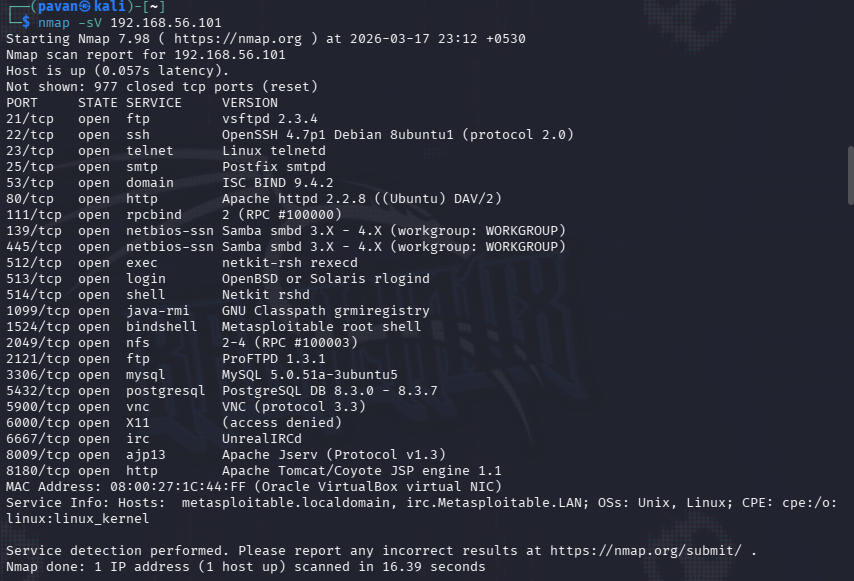
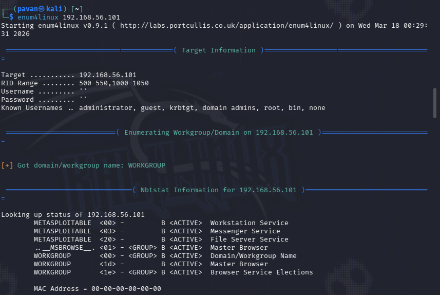
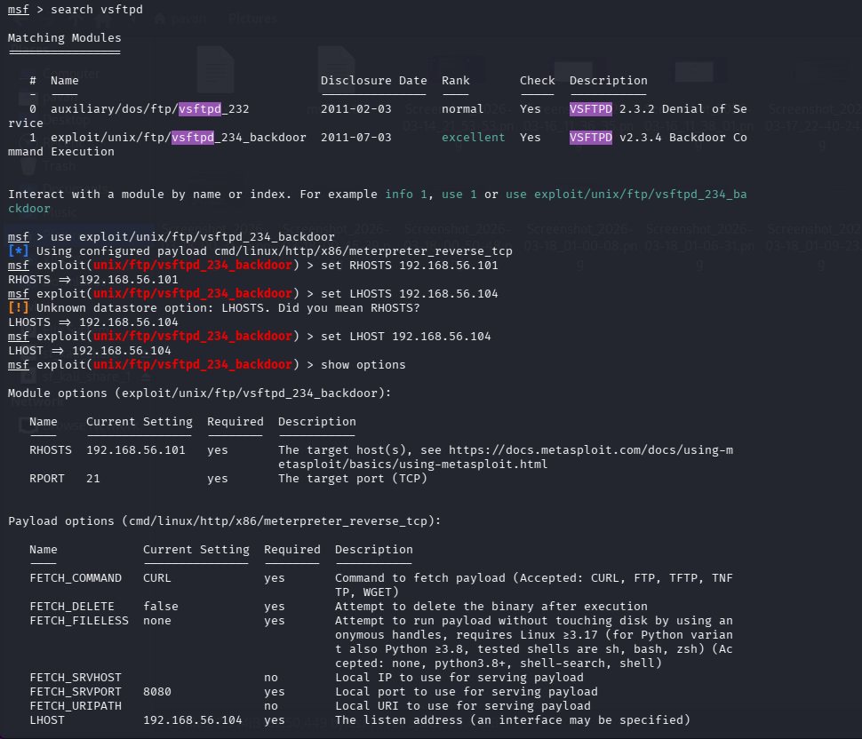
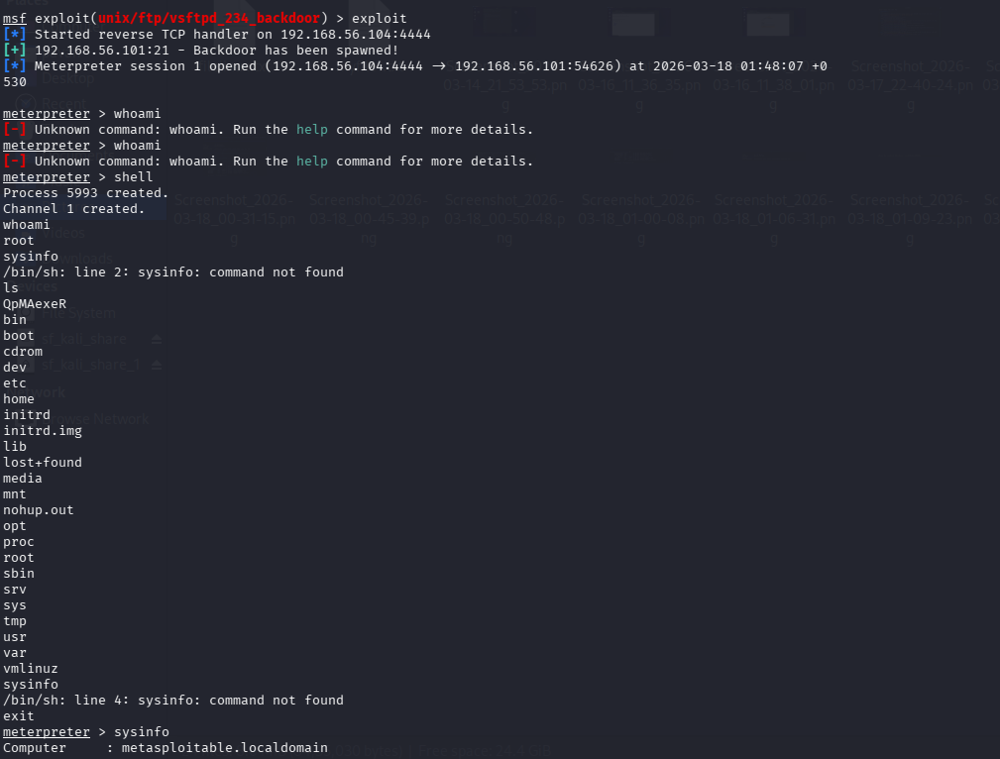
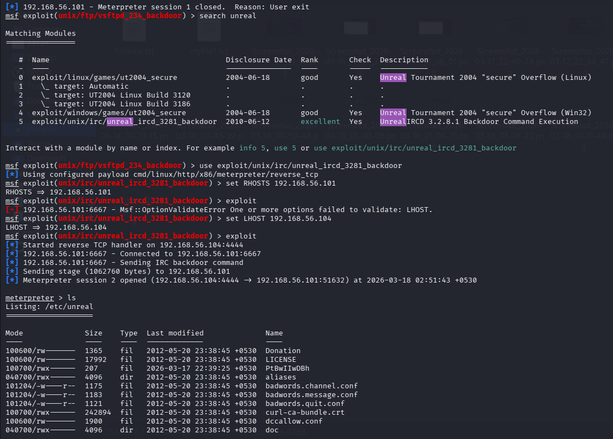
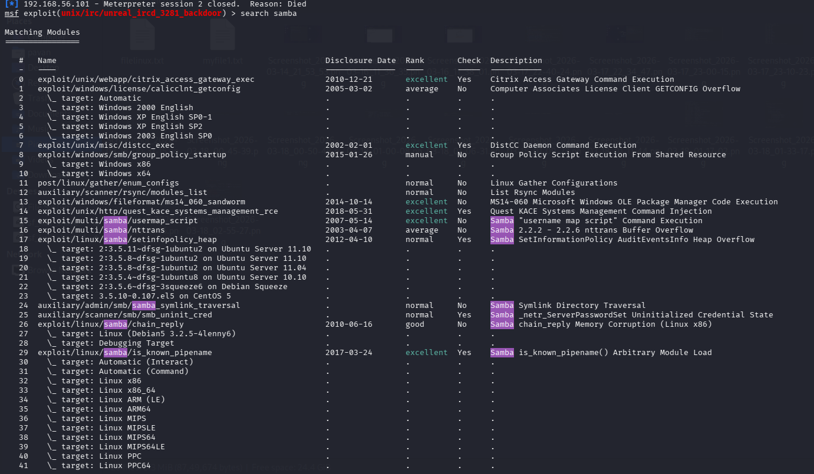
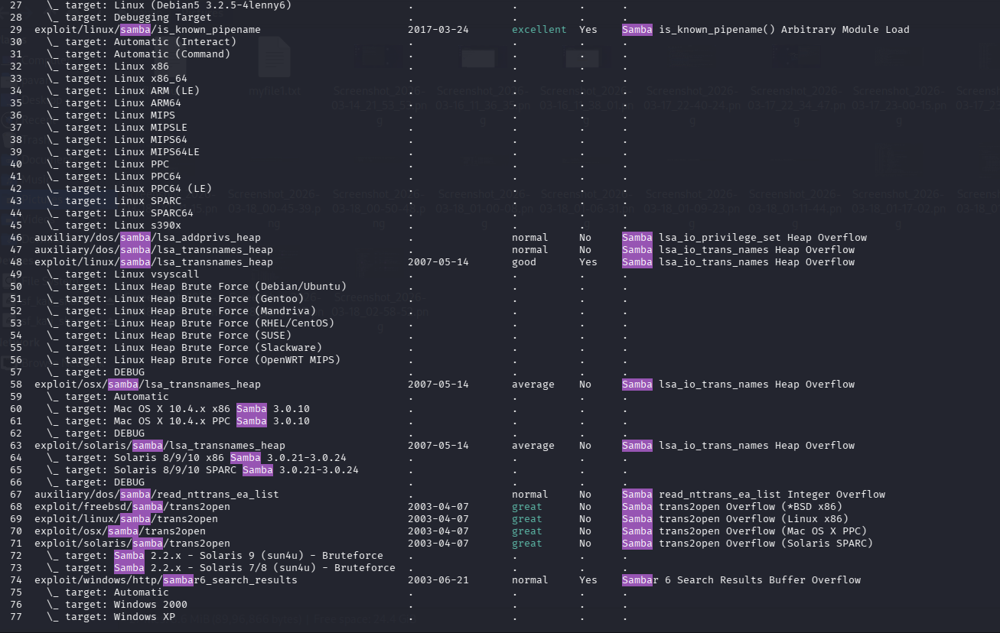
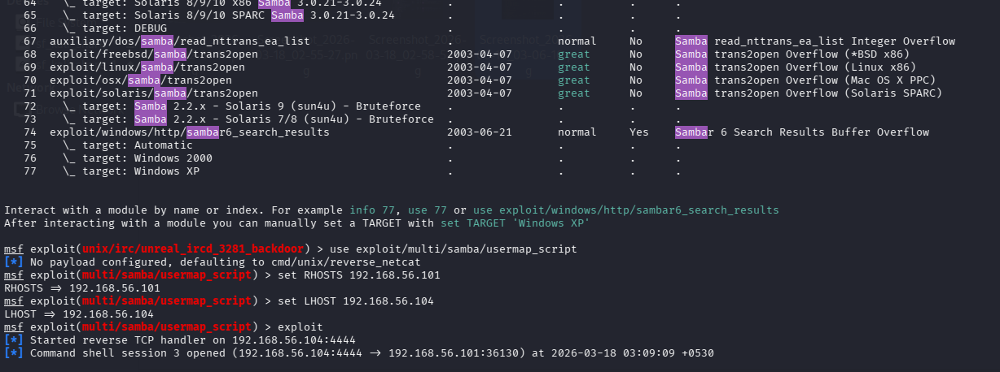
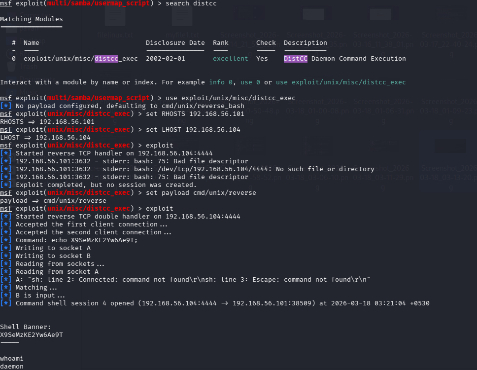
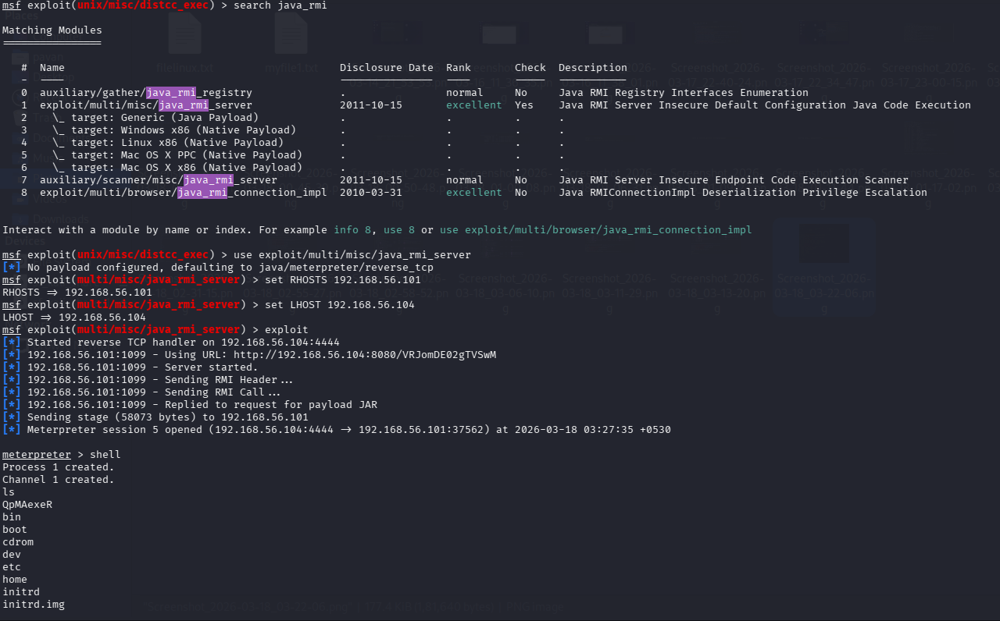

# Penetration Testing Report on Metasploitable 2

**Course:** Cybersecurity / Ethical Hacking  
**Submitted by:** Pavan N  
**Date:** 18-03-2026  
**Target Machine:** Metasploitable 2 (IP: 192.168.56.101)

---

## Overview

This project is a full penetration testing assessment performed on **Metasploitable 2**, an intentionally vulnerable virtual machine. The goal was to simulate real-world attacks to identify and exploit security weaknesses across all major phases of a pentest engagement.

---

## Tools Used

| Tool | Purpose |
|---|---|
| Kali Linux | Attacker operating system |
| Nmap | Network scanning and service enumeration |
| Nessus Essentials | Automated vulnerability assessment |
| Metasploit Framework (msfconsole) | Exploitation |
| nbtscan | NetBIOS enumeration |
| enum4linux | SMB enumeration |

---

## Methodology

The assessment followed a structured penetration testing lifecycle:

```
1. Footprinting & Reconnaissance
2. Network Scanning
3. Enumeration
4. Vulnerability Assessment
5. Exploitation
6. Remediation
7. Conclusion
```

---

## Phase Summaries

### 1. Footprinting & Reconnaissance
- Identified attacker machine IP: `192.168.56.104/24`
- Ran an Nmap ping sweep across the subnet
- Discovered **4 live hosts**; identified `192.168.56.101` as Metasploitable 2 based on the number of open ports

### 2. Network Scanning
- Used `nmap -sV` for service and version detection
- Identified **25+ open ports** including FTP, SSH, Telnet, HTTP, Samba, MySQL, PostgreSQL, VNC, IRC, and more

Key services detected:
- `21/tcp` — vsftpd 2.3.4
- `22/tcp` — OpenSSH 4.7p1
- `23/tcp` — Linux telnetd
- `80/tcp` — Apache httpd 2.2.8
- `139/445/tcp` — Samba smbd 3.X–4.X
- `3306/tcp` — MySQL 5.0.51a
- `5432/tcp` — PostgreSQL 8.3.0–8.3.7
- `5900/tcp` — VNC (protocol 3.3)
- `6667/tcp` — UnrealIRCd

### screenshot

### 3. Enumeration
- **nbtscan**: Confirmed NetBIOS name `METASPLOITABLE`, workgroup `WORKGROUP`
- **Web enumeration**: Accessed `http://192.168.56.101` — found vulnerable web apps: DVWA, Mutillidae, phpMyAdmin, TWiki, WebDAV
- **enum4linux**: Revealed null session authentication on SMB, known usernames (`administrator`, `guest`, `root`, `bin`, etc.), weak password policy (min length: 5, complexity: disabled)

### screenshot


### 4. Vulnerability Assessment
Nessus Essentials identified **68 total vulnerabilities** (Critical / High / Medium / Low).

Notable findings:

| # | Port/Service | Vulnerability |
|---|---|---|
| 1 | 21/tcp — vsftpd 2.3.4 | Backdoor (CVE-2011-2523) |
| 2 | 23/tcp — Telnet | Plaintext credential transmission |
| 3 | 139/445/tcp — Samba | Null session auth, misconfiguration |
| 4 | 6667/tcp — UnrealIRCd | Backdoor RCE (CVE-2010-2075) |
| 5 | 3306/tcp — MySQL | Weak credentials / access control |
| 6 | 5432/tcp — PostgreSQL | Weak credentials / access control |
| 7 | 5900/tcp — VNC | Weak/no authentication |
| 8 | System-wide | Weak password policy (min 5 chars, no complexity) |

### 5. Exploitation

All exploits were performed using **Metasploit Framework** from Kali Linux.

#### Exploit 1 — vsftpd 2.3.4 Backdoor (`CVE-2011-2523`)
- **Module:** `exploit/unix/ftp/vsftpd_234_backdoor`
- **Result:** Meterpreter session opened with remote shell access

### screenshot



#### Exploit 2 — UnrealIRCd Backdoor (`CVE-2010-2075`)
- **Module:** `exploit/unix/irc/unreal_ircd_3281_backdoor`
- **Result:** Meterpreter session opened; access to `/etc/unreal` confirmed

### screenshot



#### Exploit 3 — Samba Username Map Script
- **Module:** `exploit/multi/samba/usermap_script`
- **Result:** Root-level command shell obtained (`uid=0(root) gid=0(root)`)

### screenshot



#### Exploit 4 — DistCC Remote Command Execution
- **Module:** `exploit/unix/misc/distcc_exec`
- **Result:** Command shell as `daemon` user

### screenshot


#### Exploit 5 — Java RMI Remote Code Execution
- **Module:** `exploit/multi/misc/java_rmi_server`
- **Result:** Meterpreter session opened via malicious JAR payload

### screenshot


### 6. Remediation
Based on Nessus recommendations:
- Upgrade **ISC BIND** to 9.11.22, 9.16.6, 9.17.4 or later
- Upgrade **Samba** to version 4.2.11 / 4.3.8 / 4.4.2 or later
- Disable **Telnet**; replace with SSH
- Enforce strong **password policies** (length ≥ 12, complexity enabled)
- Restrict **VNC** access or require strong authentication
- Disable unused services (UnrealIRCd, DistCC, Java RMI if not needed)
- Enable **SMB signing** and disable null session authentication
- Apply regular **system updates** and enable security monitoring

---

## Key Takeaways

- Metasploitable 2 demonstrated how a single misconfigured or outdated service can lead to full system compromise
- Multiple CVEs with public exploits were present simultaneously, a common scenario in unpatched legacy systems
- Proper hardening, patching, and monitoring would have prevented every exploit demonstrated in this assessment

---
## Report
**[View Full Report](./Penetration_Testing_on_Metasploitable_2.pdf)

---

##  Author
Pavan N  
Cybersecurity Student | CEH Candidate
